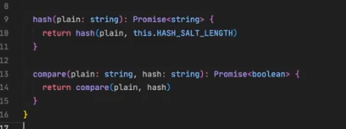

// Criar folder cryptograph, criar cryptograph module

// no folder criar jwt-hasher
- export calss JwtEncrypter implements Encrypter
- async encrypt()
  - return this.jwtService.signAsync(payload)

- Criar bcrypt-hasher
  - bcryptHasher implemtents hashGenerator, hashComparer
  