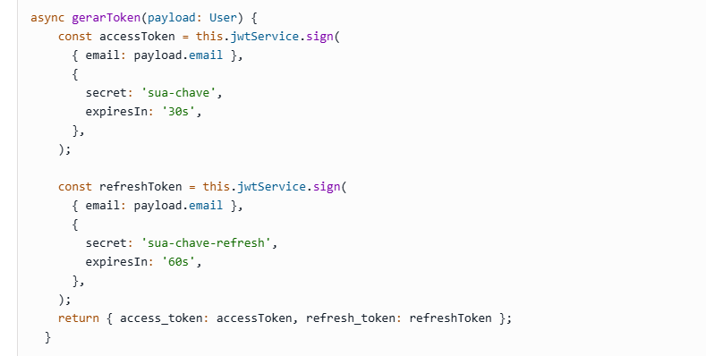

// 
PAYLOAD {
  sub,
  name,
  iat ( é quando o token foi criado )
}


em app .ts inserir linhas
```
  	app.register(fastifyJwt, {
      scret : env.JWT_SECRET,
      sign: {
        expiresIn : '10m'
      }
    })
```

Acessar controller que cria o token, alem da criacao do tken, cria o refresh token também
- Data de expiração 7 dias do refresh token
```
const sign : {
  sub : user.id,
  expiresIn : '7d'
}
```

// Refresh token envia através de um cookie
// Cookie evita que o refresh_token seja acessado por dentro do front ou usuário final
```
  setCookie('refreshToken, refreshToken), {
    path : '/', ( quais rotas da aplicação vao ter acesso a esse cookie , / é igual a todas)
    secure : true, ( significa que vai ser encryptado atraves do https),
    sameSite : true, ( cookie somente acessivel dentro do mesmo dominio ),
    httpOnly : true ( somente salvo atraves do backend, o front nao pode ver)
  }
```
## Passo a passo em NEST
Gerando Refresh Token com NestJS
Primeiramente, no arquivo auth.service.ts atualize o método gerarToken() para gerar o refresh token, neste caso alteramos o tempo de expiração e a secret key para aumentar a segurança:
